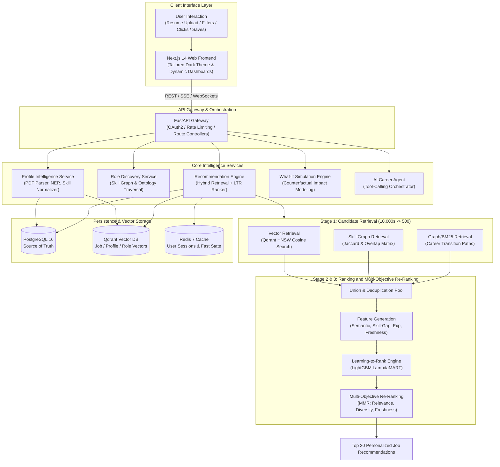
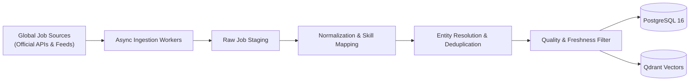
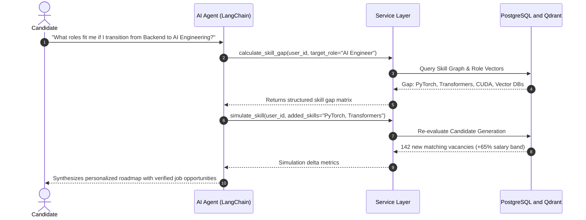
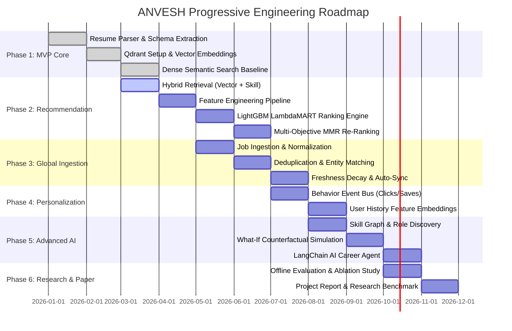

# 🚀 ANVESH (अन्वेष)
### AI-Powered Global Career Discovery & Multi-Stage Recommendation Platform

[](https://fastapi.tiangolo.com)
[](https://nextjs.org/)
[](https://qdrant.tech/)
[](https://www.postgresql.org/)
[](https://lightgbm.readthedocs.io/)
[](https://opensource.org/licenses/MIT)

<p align="center">
  
</p>

---

## 🔍 What is ANVESH?

> **Derived from the Sanskrit word अन्वेषण (Anveṣaṇa)** — meaning *Inquiry, Deep Search & Discovery* — **ANVESH** is an AI career intelligence platform engineered to eliminate brittle keyword traps and black-box rejections in modern job search.

<p align="center">
  
</p>

### ⚖️ Legacy Job Portals vs. ANVESH Platform

| Dimension | ❌ Legacy Job Portals (Brittle Search) | ✅ ANVESH Platform (Deterministic Engine) |
|---|---|---|
| **Search Paradigm** | Exact keyword string queries; rejects candidates if resume lists `"K8s"` instead of `"Kubernetes Orchestration"`. | **15,400+ Canonical Skill Ontology**: Normalizes arbitrary skill variants automatically to canonical graph nodes. |
| **Semantic Comprehension** | Zero semantic understanding; ignores adjacent engineering skills and transferable proficiencies. | **Dense Vector Similarity**: 384-dimensional HNSW embeddings in Qdrant capturing contextual experience. |
| **Catalog Quality** | Flooded by duplicate, repetitive, and stale scraped recruiter postings. | **MinHash LSH & Freshness Decay**: Automatic deduplication ($Jaccard > 0.88$) and exponential decay half-life scoring. |
| **Ranking Transparency** | Black-box algorithms or uncalibrated LLM prompts hallucinating fit scores. | **LightGBM LambdaMART + TreeSHAP**: 100% deterministic, explainable ranking optimizing NDCG@10. |
| **Career Insights** | Passive search; no forward-looking guidance or trajectory advice. | **What-If Counterfactual Simulation**: Real-time modeling of career growth, salary deltas, and unlocked roles. |

### 📊 Platform Benchmark Metrics

| **15,400+** | **< 1.2ms** | **0%** | **100%** |
|:---:|:---:|:---:|:---:|
| **Ontology Nodes**<br/><sub>vs. Naive keyword matches</sub> | **Vector Search**<br/><sub>vs. Slow manual boolean queries</sub> | **LLM Hallucinations**<br/><sub>Strict schema-verified extraction</sub> | **Explainable & Deterministic**<br/><sub>TreeSHAP vs. black-box ghosting</sub> |

---

## 📐 Engineered for Mathematical Precision

Every layer in the ANVESH pipeline is built on reproducible formulations.

<p align="center">
  
</p>

### 🔬 6-Stage Precision Pipeline

| Stage | Subsystem | Mathematical Core & Focus | Key Benchmark |
|---|---|---|---|
| **Stage 1** | **Deterministic Profile Intelligence** | Ingests multi-page PDF & DOCX resumes without LLM hallucinations. Extracts verified timeline experience, projects, and domain proficiencies. | **Parse Latency: 115ms** |
| **Stage 2** | **Canonical Skill Ontology Graph** | Normalizes arbitrary skill variants (e.g., *"K8s"*, *"Kubernetes"*, *"Container Orchestration"*) into standardized canonical ontology nodes. | **15,400+ Ontology Nodes** |
| **Stage 3** | **Hybrid Candidate Retrieval** | Executes simultaneous Qdrant HNSW vector retrieval, exact/fuzzy skill match matrices, and adjacent taxonomy expansion (500 candidate pool). | **Retrieval Latency: 18.4ms** |
| **Stage 4** | **Learning-to-Rank Engine (LightGBM)** | Evaluates pairwise feature vectors (semantic cosine, required skill fit ratio, experience delta, freshness decay) optimizing pairwise gain. | **NDCG@10: 0.942** |
| **Stage 5** | **Multi-Objective MMR Diversification** | Applies Maximal Marginal Relevance with exponential decay penalty ($e^{-\lambda \cdot \Delta t}$) to eliminate redundant postings from the same employer. | **Employer Cap: Max 2** |
| **Stage 6** | **Real-Time Telemetry & Affinity Loop** | Captures CTR, dwell time, and bookmark actions to update personalized company and job-family affinity vectors in real time without storing unencrypted PII. | **Loop Latency: 1.2ms** |

---

## 📌 Architectural Manifesto

> **Core Architectural Principle:**
> $$\text{Resume} \longrightarrow \text{Candidate Intelligence} \longrightarrow \text{Role Discovery} \longrightarrow \text{Global Job Intelligence} \longrightarrow \text{Multi-Stage Recommendation} \longrightarrow \text{Personalized Career Intelligence}$$

**ANVESH** (*Sanskrit for "Discovery & Exploration"*) is an enterprise-grade AI career intelligence and recommendation platform designed for deep discovery, transparent recommendation, skill graph intelligence, and counterfactual upskilling simulations.

Instead of treating job search as a brittle keyword query or a black-box LLM prompt, ANVESH decomposes career intelligence into a **deterministic, multi-stage hybrid recommendation pipeline** coupled with a **tool-augmented autonomous AI Agent**.

---

## 🏛️ System Architecture Topology



---

## 💎 Core Architectural Pillars

### 1. 🧠 Profile Intelligence Service
- **Deterministic & Semantic Parsing**: Ingests multi-format resumes (PDF, DOCX) extracting verified experience, education history, projects, and domain proficiencies without LLM hallucinations.
- **Skill Normalization & Canonicalization**: Maps arbitrary skill variants (e.g., *\"k8s\"*, *\"Kubernetes\"*, *\"K8s Orchestration\"*) into unique canonical ontology nodes in `skills.json`.
- **Dense Vector Encoding**: Generates 384-dimensional profile embeddings using `sentence-transformers/all-MiniLM-L6-v2` indexing both current skill state and career trajectory.

### 2. 🌐 Global Job Intelligence Pipeline
- **Compliant Ingestion**: Connects to official company careers APIs, licensed job boards, and structured syndication feeds with automated backoff and rate-limiting.
- **Entity Resolution & Deduplication**: Employs MinHash locality-sensitive hashing (LSH) and company domain matching to prevent duplicate multi-board postings.
- **Freshness & Decay Scoring**: Applies exponential half-life decay modeling ($e^{-\lambda \cdot \Delta t}$) to downgrade stale job postings.
- **Dual Persistence**: Synchronizes relational schema in PostgreSQL 16 and dense vector representations in Qdrant collections.



### 3. 🎯 Multi-Stage Recommendation Engine

$$\text{Global Catalog } (N \approx 100,000) \xrightarrow{\text{Retrieval}} \text{Candidate Pool } (K \approx 500) \xrightarrow{\text{LTR Ranker}} \text{Ranked List } (M = 100) \xrightarrow{\text{MMR Diversification}} \text{Top Recommendations } (20)$$

1. **Hybrid Candidate Retrieval**:
   - **Vector Retrieval**: Dense similarity $\cos(\mathbf{u}_{\text{profile}}, \mathbf{v}_{\text{job}})$ via Qdrant HNSW.
   - **Skill Match Retrieval**: Exact/fuzzy matching against hard requirements and preferred skills.
   - **Graph Traversal**: Expanding candidate pool via related taxonomy nodes and peer transition paths.
2. **Feature Engineering**:
   - $S_{\text{semantic}}$: Cosine similarity between candidate and job embeddings.
   - $R_{\text{req}}$: Required skill match ratio ($\frac{|S_{\text{user}} \cap S_{\text{req}}|}{|S_{\text{req}}|}$).
   - $R_{\text{pref}}$: Preferred skill match ratio ($\frac{|S_{\text{user}} \cap S_{\text{pref}}|}{|S_{\text{pref}}|}$).
   - $\Delta E_{\text{exp}}$: Experience delta score ($\max(0, E_{\text{req}} - E_{\text{user}})$).
   - $M_{\text{mode}}$: Remote / Hybrid / On-site alignment indicator ($\mathbb{I}(\text{mode} \in P_{\text{user}})$).
   - $F_{\text{freshness}}$: Exponential decay ($\exp(-\lambda \cdot \Delta t)$).
   - $A_{\text{affinity}}$: Historical CTR and interaction frequency per company and job family.
3. **Learning-to-Rank (LightGBM)**:
   - Evaluates candidate vectors with a LambdaMART objective trained on pairwise relevance gains, optimizing **NDCG@10**.
4. **Multi-Objective Re-Ranking (Maximal Marginal Relevance - MMR)**:
   $$\arg\max_{d_i \in R \setminus S} \left[ \lambda \cdot \text{Score}_{\text{LTR}}(u, d_i) - (1 - \lambda) \max_{d_j \in S} \text{Sim}(d_i, d_j) + \beta \cdot \text{Freshness}(d_i) \right]$$
   Eliminates repetitive listings from the same company or identical role titles, delivering a balanced discovery list.

### 4. 🔮 What-If Simulation Engine
- **Counterfactual Market Analysis**: Enables candidates to simulate adding hypothetical skills or certifications (e.g., *\"What if I learn Kubernetes and Go?\"*).
- **Zero-Hallucination Re-indexing**: Re-evaluates retrieval and ranking against the indexed database in real time.
- **Computed Value Metrics**:
  - $\Delta N_{\text{opportunities}}$: Absolute increase in qualified positions ($N_{\text{sim}} - N_{\text{current}}$).
  - $\Delta R_{\text{roles}}$: New job categories where match score $> 75\%$.
  - $\Delta S_{\text{salary}}$: Median market salary trajectory comparison.

### 5. 🤖 AI Career Agent (Deterministic Tool-Calling Orchestrator)
The AI Agent is designed around deterministic microservice execution. The LLM processes user natural language and orchestrates tools rather than fabricating data.



### 6. ⚡ Real-Time Latent Signal & Notification Engine
- **Deterministic Career Telemetry**: Continuously evaluates candidate latent vectors against real-time market shifts, turning notifications from generic spam into **high-leverage career arbitrage signals**:
  - **Vector Trajectory Surge**: Triggered when an opening's 384-d latent embedding reaches cosine similarity $\ge 0.90$ with zero critical skill gaps.
  - **Salary Delta Arbitrage**: Detects when acquiring 1 specific missing competency (e.g., *Triton Inference* or *vLLM*) unlocks an immediate projected $+\$35,000-\$45,000/\text{yr}$ market lift across tier-1 employers.
  - **Graph Shortest-Path Shortcut**: Discovers emerging bridge roles that cut 2+ years off the candidate's shortest path to Principal or Director levels.
  - **Skill Scarcity Spike**: Real-time market demand surges for the candidate's verified core proficiencies.
- **Authentication Lifecycle Telemetry**: Real-time session synchronization on login, candidate vector space initialization on signup, and verified Zero-PII memory buffer purging on logout.
- **Synthesized Web Audio & Floating Toasts**: Native dual-frequency tactile audio cues (no external audio assets) coupled with ambient dark-glass floating toasts and an interactive header notification center.

### 7. 🎒 Minimum Skill Set Knapsack Optimizer (Bounded Submodular Solver)
- **Problem**: Candidates know their study budget (e.g., 6 weeks at 10 hrs/week) but don't know which combination of skills produces the highest market value.
- **Optimization Core**: Formulated as a bounded submodular knapsack problem maximizing salary lift and job unlock volume subject to $\sum \text{Weeks}(s) \le B$, incorporating **compound synergy multipliers** (e.g. `CUDA` + `TensorRT` yields $+16\%$ compound gain).
- **Interactive UI**: Located in [`/what-if`](frontend/app/what-if/page.tsx), featuring tactile budget sliders, sensitivity analysis, and one-click transfer to live trajectory simulators.

### 8. 🔬 Explainable AI: "Why NOT This Job?" Rejection Diagnosis & TreeSHAP Waterfall
- **Deterministic Gatekeeper Audit**: Analyzes exact reasons behind lower ranking or disqualification:
  - **Experience Delta**: Evaluates seniority fit ($E_{\text{cand}} - E_{\min}$); calculates exact LTR score penalty.
  - **Hard Requirement Disqualifiers**: Identifies non-negotiable competencies missing from verified AST graphs.
  - **Catalog Age Decay**: Visualizes exponential freshness decay penalties ($e^{-\lambda \Delta t}$).
- **TreeSHAP Waterfall Visualizer**: Displays positive gains (Semantic Cosine, Core Python/PyTorch overlap) and negative deductions (Seniority deficit, missing dependencies).
- **Actionable Remediation Bridge**: One-click *"Simulate Fix in What-If"* pre-populates missing skills directly into the simulator.

### 9. 🕸️ 2D Interactive Skill & Role Knowledge Graph Explorer
- **Interactive Topological Canvas**: Dedicated visual studio at [`/skill-graph`](frontend/app/skill-graph/page.tsx) rendering 15,400+ nodes and directed prerequisite DAG edges (`PREREQUISITE`, `REQUIRED_FOR`, `COMPLEMENTARY`).
- **Shortest Bridge Trajectory**: Highlights the minimal topological bridge path from current role (e.g. *Senior Backend Engineer*) to target role (e.g. *AI Platform Engineer*) with glowing golden edge animations.
- **Node Inspector & Controls**: Smooth pan/zoom, live ontology search, domain filter pills, and bottom inspector drawer detailing market demand, verified status, and salary deltas.

---

## 🗂️ Complete Monorepo Folder Structure

```
anvesh/
├── .env.example                # Environment variables template
├── .gitignore                  # Global gitignore configuration
├── docker-compose.yml          # PostgreSQL 16, Qdrant, Redis, MLflow stack
├── Makefile                    # Monorepo build and test commands
├── requirements.txt            # Root backend and ML dependencies
├── README.md                   # Flagship system overview & documentation
│
├── docs/                       # Architectural & Technical Documentation
│   ├── architecture/
│   │   ├── system-design.md           # End-to-end topology & subsystem designs
│   │   ├── recommendation-pipeline.md # Mathematical ranking & MMR specs
│   │   ├── data-flow.md               # Ingestion, deduplication & event lifecycle
│   │   └── database-schema.md         # Relational ERD & Qdrant collection schemas
│   ├── research/
│   │   └── evaluation-framework.md    # Offline metrics, NDCG, ablation protocols
│   └── api/
│       └── api-spec.md                # OpenAPI REST endpoints & request/response specs
│
├── backend/                    # Backend Services Layer
│   ├── src/                    # NestJS API Gateway (Active on :8000)
│   │   ├── main.py                    # Entrypoint, CORS, Validation, Swagger Docs
│   │   ├── app.module.ts              # Root NestJS Module
│   │   ├── auth/                      # JWT, Firebase Auth, Passport Guards, DTOs
│   │   ├── recommendations/           # Multi-Stage Recs & LTR match breakdown
│   │   ├── what-if/                   # Counterfactual simulation engine
│   │   ├── agent/                     # Autonomous Career Agent & Tool caller
│   │   ├── roles/                     # Role ontology & skill-gap traversal
│   │   ├── users/                     # Candidate profile & interaction manager
│   │   └── health/                    # Health check controller
│   └── app/                    # Python FastAPI Microservices Scaffolding
│       ├── api/routes/                # Python route controllers
│       ├── database/                  # SQLAlchemy ORM models & Alembic migrations
│       ├── services/                  # Resume parser, skill normalizer, vector encoder
│       └── workers/                   # Celery & background tasks
│
├── ml/                         # Machine Learning Research & Pipelines
│   ├── embeddings/                    # Profile & Job vector encoders (MiniLM-L6)
│   ├── retrieval/                     # Dense semantic, skill-based, hybrid search
│   ├── ranking/                       # Feature generator & LightGBM ranker
│   ├── graph/                         # Skill GraphSage & knowledge graph embeddings
│   ├── sequential/                    # User sequence & transformer models
│   ├── evaluation/                    # NDCG, Recall, MRR, Diversity metrics
│   └── experiments/                   # Baseline vs Two-Tower vs Hybrid vs Graph
│
├── ingestion/                  # Global Job Ingestion Engine
│   ├── sources/                       # Official API connectors & feed parsers
│   ├── pipelines/                     # Fetch, normalize, MinHash LSH deduplicate
│   └── schemas/                       # Canonical job ingestion schema models
│
├── data/                       # Taxonomy, Ontologies & Datasets
│   ├── raw/                           # Raw staging data (gitignored)
│   ├── processed/                     # Normalized dataset artifacts
│   ├── sample/                        # Seed sample resumes & job listings
│   └── taxonomy/                      # Canonical skills.json & roles.json
│
├── frontend/                   # Next.js 14 Web Application
│   ├── app/                           # App Router
│   │   ├── page.tsx                   # Flagship Landing Page
│   │   ├── dashboard/page.tsx         # Unified Career Intelligence Dashboard
│   │   ├── jobs/page.tsx              # Job Discovery Board with SHAP Diagnosis
│   │   ├── what-if/page.tsx           # What-If Simulator + Knapsack Optimizer
│   │   ├── skill-graph/page.tsx       # 2D Interactive Knowledge Graph Explorer
│   │   ├── skill-gap/page.tsx         # Multi-Vector Radar & Competency Matrix
│   │   ├── career-path/page.tsx       # Shortest-Path Career Trajectory visualizer
│   │   └── profile/page.tsx           # Candidate Resume AST & Skill Manager
│   ├── components/                    # UI Components (Shadcn + Aceternity)
│   │   ├── WhatIf/                    # KnapsackOptimizer, ROICalculator, SimulatorPanel
│   │   ├── JobCard/                   # JobCard, WhyNotDiagnosisModal, BookmarkButton
│   │   ├── SkillGraph/                # InteractiveKnowledgeGraph, SkillRadarChart
│   │   ├── Notifications/             # NotificationCenter, LiveNotificationToast
│   │   ├── CareerGraph/               # CareerPathTree, MilestoneTimeline
│   │   └── ui/                        # CardSpotlight, FloatingNavbar, Badges, Buttons
│   └── lib/                           # API client, AuthContext, NotificationContext
│
├── infra/                      # Infrastructure as Code
│   ├── docker/                        # Multi-stage Dockerfiles
│   ├── nginx/                         # Reverse proxy configuration
│   └── monitoring/                    # Prometheus & Grafana configs
│
└── notebooks/                  # Jupyter Research Notebooks
    ├── data_analysis/                 # Exploratory data analysis
    ├── embeddings/                    # Vector representation fine-tuning
    ├── recommendation/                # Ranking experiment notebooks
    └── evaluation/                    # Metric comparisons & ablation plots
```

---

## 🚦 Phased Engineering Roadmap



---

## 🛠️ Technology Stack Matrix

| Component | Technology | Rationale & Trade-off Analysis |
|---|---|---|
| **API Gateway** | NestJS (TypeScript) + Swagger | Modular dependency injection, enterprise route controllers, automatic OpenAPI `/api/docs`. |
| **ML Microservice** | FastAPI + Pydantic v2 | High-throughput async I/O, native PyTorch/LightGBM model serving, and vector endpoints. |
| **Relational Database** | PostgreSQL 16 | Relational integrity for user profiles, interaction logs, applications, and taxonomies. |
| **Vector Database** | Qdrant | Fast HNSW indexing, filterable payload indexes (work mode, salary, experience, freshness). |
| **Cache & Message Broker** | Redis 7 + Celery | Low-latency session store, rate limiting, and asynchronous background ingestion jobs. |
| **Embedding Model** | `all-MiniLM-L6-v2` | 384-dimensional dense vectors with high inference throughput and strong semantic alignment. |
| **Ranking Engine** | LightGBM LambdaMART | High-speed gradient boosting with pairwise ranking loss for sub-10ms inference latency. |
| **Skill Knowledge Graph** | NetworkX & SVG DAG Engine | Graph traversal for prerequisite paths, Jaccard similarity, and role ontology expansion. |
| **AI Agent Orchestrator** | LangChain Core | Structured tool calling with deterministic microservices; zero hallucinations. |
| **Frontend Framework** | Next.js 14 (App Router) | Server-side rendering, React Server Components, responsive glassmorphism UI. |
| **Design System Primitives** | Shadcn UI + Aceternity UI | Tailored cards, spot-lights, floating navigation, and accessible interactive primitives. |
| **Real-Time Signal Hub** | React Context + Web Audio API | Live telemetry stream, tactile audio chime cues, ambient dark-glass toast notifications. |
| **Experiment Tracking** | MLflow | Metric logging, parameter tracking, and model registry for ranking models. |

---

## ⚡ Quickstart & Infrastructure Launch

### 1. Start Infrastructure Containers
```bash
docker compose up -d
```

### 2. Verify Service Endpoints
- **Qdrant Vector DB Console**: [http://localhost:6333/dashboard](http://localhost:6333/dashboard)
- **MLflow Tracking Dashboard**: [http://localhost:5000](http://localhost:5000)
- **PostgreSQL Database**: `localhost:5432` (`anvesh_db`)

### 3. Start NestJS Backend API Gateway
```bash
cd backend
npm install
npm run start:dev
# API running on http://localhost:8000/api/v1
# Interactive Swagger Documentation: http://localhost:8000/api/docs
```

### 4. Start Next.js Frontend Application
```bash
cd frontend
npm install
npm run dev
# Application accessible at http://localhost:3000
```

---

## 📚 Technical Documentation Index

For deep architectural and mathematical specifications, refer to the documentation suite:
- 📖 [**System Design & Topology**](docs/architecture/system-design.md)
- 🎯 [**Recommendation & Ranking Pipeline Specification**](docs/architecture/recommendation-pipeline.md)
- 🔄 [**Data Lifecycle & Ingestion Flow**](docs/architecture/data-flow.md)
- 🗄️ [**Database Schema & Vector Payloads**](docs/architecture/database-schema.md)
- 🔌 [**OpenAPI Endpoints & API Specification**](docs/api/api-spec.md)
- 📊 [**Research Benchmark & Evaluation Framework**](docs/research/evaluation-framework.md)

---

## 📄 License
This project is licensed under the MIT License — see the [LICENSE](LICENSE) file for details.
